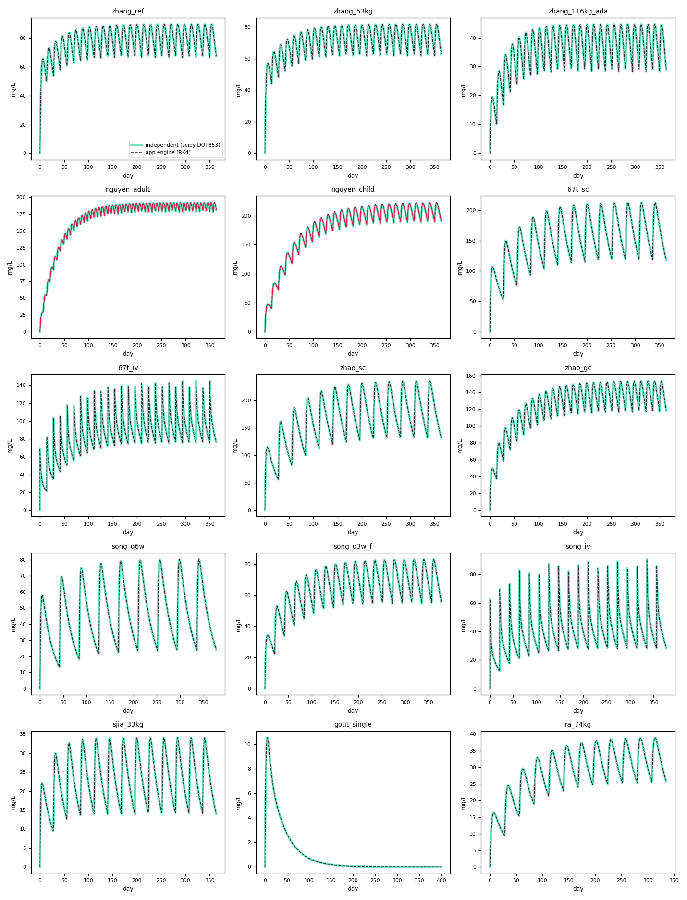
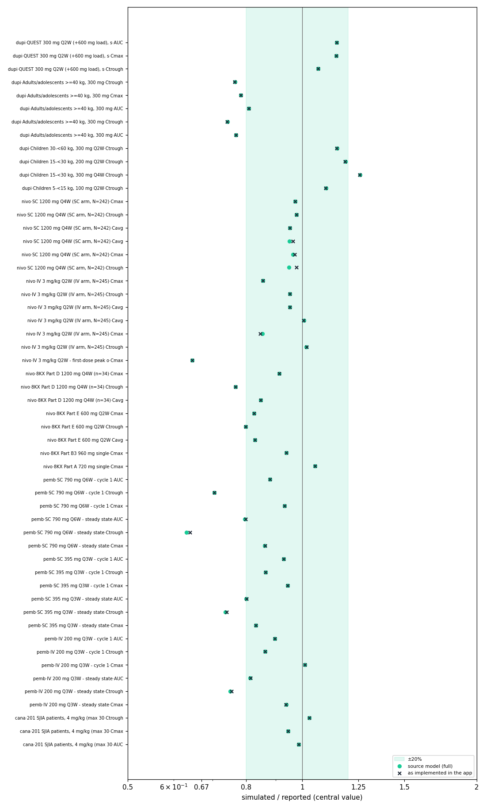

# Validation of the SC models — KINENTRIX simulator

Generated by `validation/run_validation.py` (2026-09-22, 23 s). Models: the eight SC models added on 2026-09-18. Nothing here is shown in the app.

## Method

- **A. Parameters** — the typical parameters the app builds from its spec files, compared with a second, independent transcription from the source documents (`validation/independent.py`), at the same covariates.
- **B. Engine** — concentration–time profiles from the app engine (`app_runner.js`, the app's own `covmodel.js`/`pksim.js`, fixed-step RK4) and from an independent ODE solution (scipy DOP853, rtol 1e-9, integrated between dosing events), same subject, regimen and structure. Differences are measured where the concentration is above 1% of its peak.
- **C. Population** — 1000 virtual subjects drawn from each source's own population table, simulated with the independent model and summarised the way the source reports (GM/CV, mean/SD or median/5th–95th). Pass = simulated central value within ±20% of the reported one. Run twice: the full source model, and the model as the app implements it (no transit absorption, no IIV on the time-varying CL Emax).

## A. Parameters

121 parameter values compared across 15 scenarios; **112 agree to within 0.1%**.

| Scenario | Parameter | App | Independent | Difference | Explanation |
|---|---|---|---|---|---|
| nguyen_adult | CL | 0.13689 | 0.13707 | -0.13% | weight exponents: the app uses Table 2 (CL 1.08, Vss 0.710); the independent entry follows the published NONMEM code (1.0775, 0.7041) |
| nguyen_adult | Vp | 1.9078 | 1.9035 | +0.22% | weight exponents: the app uses Table 2 (CL 1.08, Vss 0.710); the independent entry follows the published NONMEM code (1.0775, 0.7041) |
| nguyen_adult | Vmax | 0.83689 | 0.83353 | +0.40% | rounding: the app uses the paper's Table 2 values (Vmax 1.07 x 0.782, Km 0.134); the independent entry uses the code's exact thetas |
| nguyen_adult | Km | 0.134 | 0.13357 | +0.32% | rounding: the app uses the paper's Table 2 values (Vmax 1.07 x 0.782, Km 0.134); the independent entry uses the code's exact thetas |
| nguyen_child | CL | 0.039268 | 0.03943 | -0.41% | weight exponents: the app uses Table 2 (CL 1.08, Vss 0.710); the independent entry follows the published NONMEM code (1.0775, 0.7041) |
| nguyen_child | Vc | 1.3856 | 1.3963 | -0.77% | weight exponents: the app uses Table 2 (CL 1.08, Vss 0.710); the independent entry follows the published NONMEM code (1.0775, 0.7041) |
| nguyen_child | Vp | 0.85223 | 0.85609 | -0.45% | weight exponents: the app uses Table 2 (CL 1.08, Vss 0.710); the independent entry follows the published NONMEM code (1.0775, 0.7041) |
| nguyen_child | Vmax | 0.83689 | 0.83353 | +0.40% | rounding: the app uses the paper's Table 2 values (Vmax 1.07 x 0.782, Km 0.134); the independent entry uses the code's exact thetas |
| nguyen_child | Km | 0.134 | 0.13357 | +0.32% | rounding: the app uses the paper's Table 2 values (Vmax 1.07 x 0.782, Km 0.134); the independent entry uses the code's exact thetas |

## B. Engine

| Scenario | What it exercises | Max diff | Mean diff | Cmax app / indep | Last conc app / indep | AUC app / indep |
|---|---|---|---|---|---|---|
| zhang_ref | reference subject, 600 mg load then 300 mg Q2W | 0.01% | 0.002% | 89.67 / 89.67 | 66.57 / 66.57 | 28264 / 28265 |
| zhang_53kg | 52.9 kg, 400 mg load then 200 mg Q2W (non-linear range) | 0.01% | 0.002% | 81.92 / 81.92 | 61.92 / 61.92 | 25779 / 25779 |
| zhang_116kg_ada | 116 kg, ALB 38, CrCL 80, ADA positive - every covariate moved | 0.00% | 0.002% | 44.74 / 44.74 | 28.36 / 28.36 | 13017 / 13017 |
| nguyen_adult | EoE 70 kg, 300 mg QW | 0.32% | 0.101% | 192.3 / 192 | 178.4 / 178.2 | 61341 / 61276 |
| nguyen_child | EoE child 22.5 kg, 200 mg Q2W | 1.12% | 0.545% | 222.5 / 221.4 | 189.9 / 189 | 65378 / 65033 |
| 67t_sc | reference subject, 1200 mg SC Q4W | 0.00% | 0.000% | 213.1 / 213.1 | 117.9 / 117.9 | 55132 / 55132 |
| 67t_iv | female, PS 1+, 76.5 kg, eGFR 63; 3 mg/kg IV Q2W (30-min infusion) | 0.00% | 0.000% | 144.9 / 144.9 | 75.69 / 75.69 | 31280 / 31280 |
| zhao_sc | female, PS 1+ (both F multipliers), 60 kg, eGFR 70; 1200 mg SC Q4W | 0.00% | 0.000% | 235.8 / 235.8 | 131.3 / 131.3 | 60167 / 60167 |
| zhao_gc | gastric cancer term; 600 mg SC Q2W | 0.00% | 0.000% | 153.7 / 153.7 | 117.1 / 117.1 | 45009 / 45009 |
| song_q6w | reference subject, 790 mg SC Q6W | 0.00% | 0.000% | 80.23 / 80.23 | 23.62 / 23.62 | 17417 / 17417 |
| song_q3w_f | every covariate moved (female, ECOG 0, NSCLC, 60 kg, ALB 35 ...); 395 mg SC Q3W | 0.00% | 0.000% | 83.13 / 83.13 | 54.98 / 54.98 | 24202 / 24202 |
| song_iv | 69 kg NSCLC; 200 mg IV Q3W (30-min infusion) | 0.00% | 0.000% | 90.57 / 90.57 | 28.03 / 28.03 | 15247 / 15247 |
| sjia_33kg | 33 kg, ALB 33.3; 4 mg/kg SC Q4W | 0.00% | 0.000% | 34.04 / 34.04 | 13.94 / 13.94 | 8347.7 / 8347.7 |
| gout_single | typical 93 kg; single 150 mg SC | 0.00% | 0.000% | 10.55 / 10.55 | 0.000208 / 0.000208 | 389.73 / 389.73 |
| ra_74kg | 74 kg; 150 mg SC Q4W | 0.00% | 0.000% | 38.87 / 38.87 | 25.47 / 25.47 | 9480.1 / 9480.1 |

**Transit absorption left out by the app (Nguyen 2026).** The source model delays SC absorption through 3 transit compartments (MTT 0.0726 day). Effect of leaving it out, same subject:

- nguyen_adult: Cmax 192 without vs 192 with transit; last concentration 178.2 vs 178.5; largest pointwise difference 64%, reached about 4 hours after the first dose while the concentration is still rising from zero (checked separately: after the first dosing interval the difference is at most 4%).
- nguyen_child: Cmax 221.4 without vs 221.4 with transit; last concentration 189 vs 189.2; largest pointwise difference 224%, reached about 4 hours after the first dose while the concentration is still rising from zero (checked separately: after the first dosing interval the difference is at most 4%).

## C. Population

**40/54** within ±20% with the full source model, **41/54** as implemented in the app.

| Model | Group | Metric | Window (day) | Reported | Simulated (full model) | Ratio | As in app | Ratio |
|---|---|---|---|---|---|---|---|---|
| dupilumab_zhang2021 | QUEST 300 mg Q2W (+600 mg load), steady state | AUC — mean (SD) | 350–364 | 1090 593 | 1251 797 | 1.15 | 1251 | 1.15 |
| dupilumab_zhang2021 | QUEST 300 mg Q2W (+600 mg load), steady state | Cmax — mean (SD) | 350–364 | 86.9 44.8 | 99.44 60.7 | 1.14 | 99.44 | 1.14 |
| dupilumab_zhang2021 | QUEST 300 mg Q2W (+600 mg load), steady state | Ctrough — mean (SD) | 350–364 | 70 40.9 | 74.55 51.7 | 1.07 | 74.55 | 1.07 |
| dupilumab_nguyen2026 | Adults/adolescents >=40 kg, 300 mg QW | Ctrough — median (5–95th) | 371–378 | 207 (113, 383) | 158.6 (61.9, 365) | **0.77** | 158.2 | **0.76** |
| dupilumab_nguyen2026 | Adults/adolescents >=40 kg, 300 mg QW | Cmax — median (5–95th) | 371–378 | 222 (126, 396) | 173.9 (70.4, 391) | **0.78** | 173.9 | **0.78** |
| dupilumab_nguyen2026 | Adults/adolescents >=40 kg, 300 mg QW | AUC — median (5–95th) | 371–378 | 1518 (851, 2.74e+03) | 1228 (604, 2.54e+03) | 0.81 | 1228 | 0.81 |
| dupilumab_nguyen2026 | Adults/adolescents >=40 kg, 300 mg Q2W | Ctrough — median (5–95th) | 364–378 | 87 (39, 174) | 64.66 (18.1, 167) | **0.74** | 64.53 | **0.74** |
| dupilumab_nguyen2026 | Adults/adolescents >=40 kg, 300 mg Q2W | AUC — median (5–95th) | 364–378 | 1420 (719, 2.66e+03) | 1091 (487, 2.4e+03) | **0.77** | 1091 | **0.77** |
| dupilumab_nguyen2026 | Children 30-<60 kg, 300 mg Q2W | Ctrough — median (5–95th) | 364–378 | 134 (64, 261) | 154 (61.3, 328) | 1.15 | 153.7 | 1.15 |
| dupilumab_nguyen2026 | Children 15-<30 kg, 200 mg Q2W | Ctrough — median (5–95th) | 364–378 | 156 (73, 314) | 185.3 (78.9, 380) | 1.19 | 185 | 1.19 |
| dupilumab_nguyen2026 | Children 15-<30 kg, 300 mg Q4W | Ctrough — median (5–95th) | 364–392 | 89 (37, 201) | 112.1 (38.3, 252) | **1.26** | 111.9 | **1.26** |
| dupilumab_nguyen2026 | Children 5-<15 kg, 100 mg Q2W | Ctrough — median (5–95th) | 364–378 | 149 (75, 278) | 163.8 (70.2, 333) | 1.10 | 163.6 | 1.10 |
| nivolumab_sc_67t | SC 1200 mg Q4W (SC arm, N=242) | Cmax — GM (CV%) | 0–28 | 108 32.7 | 105 35.7 | 0.97 | 105 | 0.97 |
| nivolumab_sc_67t | SC 1200 mg Q4W (SC arm, N=242) | Ctrough — GM (CV%) | 0–28 | 50.8 44.2 | 49.62 44.7 | 0.98 | 49.64 | 0.98 |
| nivolumab_sc_67t | SC 1200 mg Q4W (SC arm, N=242) | Cavg — GM (CV%) | 0–28 | 78.8 35.6 | 75.02 34 | 0.95 | 75.02 | 0.95 |
| nivolumab_sc_67t | SC 1200 mg Q4W (SC arm, N=242) | Cavg — GM (CV%) | 336–364 | 182 43.5 | 172.8 51.6 | 0.95 | 175.4 | 0.96 |
| nivolumab_sc_67t | SC 1200 mg Q4W (SC arm, N=242) | Cmax — GM (CV%) | 336–364 | 230 39.2 | 221.6 44.2 | 0.96 | 223.1 | 0.97 |
| nivolumab_sc_67t | SC 1200 mg Q4W (SC arm, N=242) | Ctrough — GM (CV%) | 336–364 | 126 51 | 119.6 70.5 | 0.95 | 123.2 | 0.98 |
| nivolumab_sc_67t | IV 3 mg/kg Q2W (IV arm, N=245) | Cmax — GM (CV%) | 0–28 | 91.7 35.5 | 78.42 29.9 | 0.86 | 78.42 | 0.86 |
| nivolumab_sc_67t | IV 3 mg/kg Q2W (IV arm, N=245) | Ctrough — GM (CV%) | 0–28 | 31.9 29.6 | 30.35 35.1 | 0.95 | 30.34 | 0.95 |
| nivolumab_sc_67t | IV 3 mg/kg Q2W (IV arm, N=245) | Cavg — GM (CV%) | 0–28 | 37.7 25.3 | 35.87 27.7 | 0.95 | 35.87 | 0.95 |
| nivolumab_sc_67t | IV 3 mg/kg Q2W (IV arm, N=245) | Cavg — GM (CV%) | 336–350 | 92.5 34.4 | 93.19 48.4 | 1.01 | 92.91 | 1.00 |
| nivolumab_sc_67t | IV 3 mg/kg Q2W (IV arm, N=245) | Cmax — GM (CV%) | 336–350 | 160 27.6 | 136.6 38.1 | 0.85 | 135.4 | 0.85 |
| nivolumab_sc_67t | IV 3 mg/kg Q2W (IV arm, N=245) | Ctrough — GM (CV%) | 336–350 | 71.5 40.1 | 72.59 60.2 | 1.02 | 72.82 | 1.02 |
| nivolumab_sc_67t | IV 3 mg/kg Q2W - first-dose peak only | Cmax — GM (CV%) | 0–14 | 91.7 35.5 | 59.21 32.7 | **0.65** | 59.21 | **0.65** |
| nivolumab_sc_zhao2025 | 8KX Part D 1200 mg Q4W (n=34) | Cmax — GM (CV%) | 0–28 | 106 46 | 96.81 46 | 0.91 | 96.81 | 0.91 |
| nivolumab_sc_zhao2025 | 8KX Part D 1200 mg Q4W (n=34) | Ctrough — GM (CV%) | 0–28 | 54.4  | 41.7 48.7 | **0.77** | 41.72 | **0.77** |
| nivolumab_sc_zhao2025 | 8KX Part D 1200 mg Q4W (n=34) | Cavg — GM (CV%) | 0–28 | 79.7  | 67.6 42.8 | 0.85 | 67.61 | 0.85 |
| nivolumab_sc_zhao2025 | 8KX Part E 600 mg Q2W | Cmax — GM (CV%) | 0–14 | 57.8 31 | 47.69 45.5 | 0.83 | 47.69 | 0.83 |
| nivolumab_sc_zhao2025 | 8KX Part E 600 mg Q2W | Ctrough — GM (CV%) | 0–14 | 43.6  | 34.84 40.5 | **0.80** | 34.84 | **0.80** |
| nivolumab_sc_zhao2025 | 8KX Part E 600 mg Q2W | Cavg — GM (CV%) | 0–14 | 47.19  | 39.08 44 | 0.83 | 39.08 | 0.83 |
| nivolumab_sc_zhao2025 | 8KX Part B3 960 mg single | Cmax — GM (CV%) | 0–28 | 81.4 41 | 76.47 47.7 | 0.94 | 76.47 | 0.94 |
| nivolumab_sc_zhao2025 | 8KX Part A 720 mg single | Cmax — GM (CV%) | 0–28 | 54.8 51 | 57.68 47.8 | 1.05 | 57.68 | 1.05 |
| pembrolizumab_sc_song2025 | SC 790 mg Q6W - cycle 1 | AUC — GM (CV%) | 0–42 | 1597 39.2 | 1405 37.6 | 0.88 | 1405 | 0.88 |
| pembrolizumab_sc_song2025 | SC 790 mg Q6W - cycle 1 | Ctrough — GM (CV%) | 0–42 | 18.8 55.5 | 13.25 68.1 | **0.70** | 13.25 | **0.71** |
| pembrolizumab_sc_song2025 | SC 790 mg Q6W - cycle 1 | Cmax — GM (CV%) | 0–42 | 63.1 41.9 | 58.85 39.8 | 0.93 | 58.85 | 0.93 |
| pembrolizumab_sc_song2025 | SC 790 mg Q6W - steady state | AUC — GM (CV%) | 84–126 | 2506 42.8 | 1994 44.3 | **0.80** | 2000 | **0.80** |
| pembrolizumab_sc_song2025 | SC 790 mg Q6W - steady state | Ctrough — GM (CV%) | 84–126 | 33.6 57.7 | 21.22 77.8 | **0.63** | 21.49 | **0.64** |
| pembrolizumab_sc_song2025 | SC 790 mg Q6W - steady state | Cmax — GM (CV%) | 84–126 | 90.1 41.6 | 77.63 40.5 | 0.86 | 77.7 | 0.86 |
| pembrolizumab_sc_song2025 | SC 395 mg Q3W - cycle 1 | AUC — GM (CV%) | 0–21 | 511 39.2 | 474.9 35 | 0.93 | 474.9 | 0.93 |
| pembrolizumab_sc_song2025 | SC 395 mg Q3W - cycle 1 | Ctrough — GM (CV%) | 0–21 | 18.8 39.5 | 16.25 37.2 | 0.86 | 16.25 | 0.86 |
| pembrolizumab_sc_song2025 | SC 395 mg Q3W - cycle 1 | Cmax — GM (CV%) | 0–21 | 31.5 41.8 | 29.74 38.8 | 0.94 | 29.74 | 0.94 |
| pembrolizumab_sc_song2025 | SC 395 mg Q3W - steady state | AUC — GM (CV%) | 105–126 | 1282 42.8 | 1025 43.1 | **0.80** | 1027 | 0.80 |
| pembrolizumab_sc_song2025 | SC 395 mg Q3W - steady state | Ctrough — GM (CV%) | 105–126 | 47.8 47.4 | 35.18 52.7 | **0.74** | 35.38 | **0.74** |
| pembrolizumab_sc_song2025 | SC 395 mg Q3W - steady state | Cmax — GM (CV%) | 105–126 | 72.5 42 | 60.26 41.5 | 0.83 | 60.3 | 0.83 |
| pembrolizumab_sc_song2025 | IV 200 mg Q3W - cycle 1 | AUC — GM (CV%) | 0–21 | 534 21.8 | 478.9 22.1 | 0.90 | 478.9 | 0.90 |
| pembrolizumab_sc_song2025 | IV 200 mg Q3W - cycle 1 | Ctrough — GM (CV%) | 0–21 | 14.3 30.7 | 12.34 34 | 0.86 | 12.34 | 0.86 |
| pembrolizumab_sc_song2025 | IV 200 mg Q3W - cycle 1 | Cmax — GM (CV%) | 0–21 | 64 19.7 | 64.65 22.8 | 1.01 | 64.65 | 1.01 |
| pembrolizumab_sc_song2025 | IV 200 mg Q3W - steady state | AUC — GM (CV%) | 105–126 | 1130 31.1 | 917.8 34.3 | 0.81 | 919.4 | 0.81 |
| pembrolizumab_sc_song2025 | IV 200 mg Q3W - steady state | Ctrough — GM (CV%) | 105–126 | 36.3 41.2 | 27.25 51.8 | **0.75** | 27.41 | **0.76** |
| pembrolizumab_sc_song2025 | IV 200 mg Q3W - steady state | Cmax — GM (CV%) | 105–126 | 98.8 22.9 | 92.71 21.9 | 0.94 | 92.64 | 0.94 |
| canakinumab_sjia | 201 SJIA patients, 4 mg/kg (max 300 mg) Q4W, steady state | Ctrough — mean (SD) | 336–364 | 14.68 8.8 | 15.09 7.75 | 1.03 | 15.09 | 1.03 |
| canakinumab_sjia | 201 SJIA patients, 4 mg/kg (max 300 mg) Q4W, steady state | Cmax — mean (SD) | 336–364 | 36.5 14.9 | 34.53 13 | 0.95 | 34.53 | 0.95 |
| canakinumab_sjia | 201 SJIA patients, 4 mg/kg (max 300 mg) Q4W, steady state | AUC — mean (SD) | 336–364 | 696.1 327 | 685.9 270 | 0.99 | 685.9 | 0.99 |

## Caveats

- The independent transcription was made by the same team that built the specs, from the same documents; it catches transcription and conversion errors and engine errors, not errors in the source documents themselves.
- Population tables often give only mean/SD or median/range; where a covariate distribution is not published (pembrolizumab SC: albumin, bilirubin, tumour size, eGFR) it is held at the model reference.
- Reported model-based exposures come from individual (post hoc) estimates of the trial subjects; the simulation draws new subjects, so agreement is expected on central values more than on spreads.
